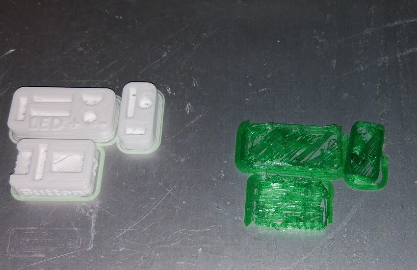

# IMPRESORAS 3D. CONFIGURACIÓN, MANEJO Y APLICACIÓN DIDÁCTICA ([191814GE030](https://www.juntadeandalucia.es/educacion/seneca/seneca/jsp/gestionactividades/DetActForPub.jsp?X_EDIACTFOR=187950))

## CEP BAZA

### José Antonio Vacas @javacasm

## https://github.com/javacasm/3dBaza2ed

# Cuidados a la hora de imprimir

	* El filamento
		* Tipos
		* Características (temperaturas)
		* Su historia (cómo lo hemos cuidado)

    

  * Condiciones externas
    * Temperatura del exterior (abrir una ventana). Ejemplo sótano
    * Humedad: adhesión
